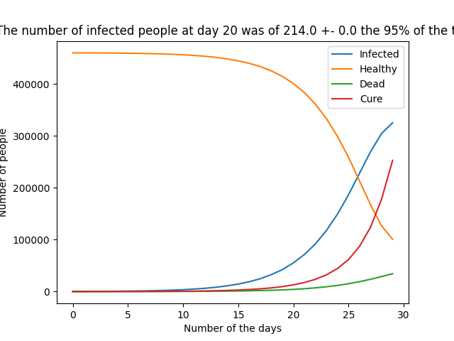

# Coronavirus Simulator

This is a Montecarlo Simulation that tries to simulate the advanced os the coronavirus pandemic. It is written in python, **it is not optimizated**. It has been written using the conda environment at only the libraries including in it are necessary (pandas, numpy, pylab specifically).

## Files

- ### [coronavirus_sim.py](coronavirus_sim.py)

  It is the main file. The sim_virus function executes de simulator, it's parameters control the pandemic caracteristics (dead probability per day, infection probability...). When finished the program will output the result to various .csv files (one per simulation) and to a pylab figure.

- ### [load_figures.py](./load_figures.py)

  Helper script for creating pylab figures from .csv.

- ### [data](./data/)
  Folder containing real .csv data from the virus (the Data is from Spain)
- ### [figures](./fugyues/)

  Folder containing output (.csv and figures) from the program

- ### [coronavirus_sim.ipynb](./coronavirus_sim.ipynb)
  Jupyter notebook containing some usefull jobs. It creates the .csv of actives infections (total - deads - cured) inside the data folder (using the .csv of the same folder). It creates a plot comparing some data of the simulation and the real data (using load_figures.py).

## Simulation parameters

- ### index

  Number of simulation, useful to differentiate the data and plot for multiple simulation with different parameters

- ### init_healthy

  Number of initial healthy population at day 0

- ### init_infected
  Number of initial infected population at day 0
- ### death_prob

  Probability for dying at every day if infected

- ### cure_prob

  Probability for curing at every day if infected

- ### inf_prob

  Probability of infecting another person each day (for each infected person)

- ### on_risk_ratio

  Ratio of people on risk (higher death_prob)

- ### days_before_cure

  Days that a person has to pass before the cure_prob starts to take effect.

- ### num_trials

  Number of trials that the simulations does (for the data output it will use the main of the trials).

- ### days_to_check

  Number of days to simulate.

- ### to_print=False

  If true the program will print the infected population after every day.

- ### start_of_quarantine=None)
  Day that the quarantine starts (the inf_prob decrease a lot)
